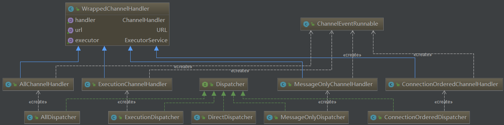

## 调度器 Dispatcher

1. 调度策略
- all 所有消息都派发到线程池，包括请求，响应，连接事件，断开事件，心跳等。
- direct 所有消息都不派发到线程池，全部在 IO 线程上直接执行。
- message 只有请求响应消息派发到线程池，其它连接断开事件，心跳等消息，直接在 IO 线程上执行。
- execution 只请求消息派发到线程池，不含响应，响应和其它连接断开事件，心跳等消息，直接在 IO 线程上执行。
- connection 在 IO 线程上，将连接断开事件放入队列，有序逐个执行，其它消息派发到线程池。

2. 线程池 ThreadPool


- fixed 固定大小线程池，启动时建立线程，不关闭，一直持有。(缺省)
- cached 缓存线程池，空闲一分钟自动删除，需要时重建。
- limited 可伸缩线程池，但池中的线程数只会增长不会收缩。只增长不收缩的目的是为了避免收缩时突然来了大流量引起的性能问题。
- eager 优先创建Worker线程池。在任务数量大于corePoolSize但是小于maximumPoolSize时，优先创建Worker来处理任务。当任务数量大于maximumPoolSize时，将任务放入阻塞队列中。阻塞队列充满时抛出RejectedExecutionException。(相比于cached:cached在任务数量超过maximumPoolSize时直接抛出异常而不是将任务放入阻塞队列)


从上面可以看到所有的请求、响应、连接、断开都经过Dispatcher之手。

那我想着具体看下`Dispatcher`的源码吧
```
@SPI(AllDispatcher.NAME)
public interface Dispatcher {

    /**
     * dispatch the message to threadpool.
     *
     * @param handler
     * @param url
     * @return channel handler
     */
    @Adaptive({Constants.DISPATCHER_KEY, "dispather", "channel.handler"})
    // The last two parameters are reserved for compatibility with the old configuration
    ChannelHandler dispatch(ChannelHandler handler, URL url);

}
```

哇哇哇哇
这个SPI是什么东西啊？

> Marker for extension interface 扩展接口标识


哦，扩展点，暂且认为是Bean这种东西吧
这个Adaptive又是什么东西？

> Decide which target extension to be injected. 决定注入那一个扩展点


哦 果然和`@AutoWired`差不多的意思

我想看有多少个实现，干了什么，先看下类图吧



每一种`Dispatcher`的策略都有一个`Dispatcher`和一个对应的`ChannelHandler`

### all

回顾一下`all`的策略

> 所有消息都派发到线程池，包括请求，响应，连接事件，断开事件，心跳等。

看一下`AllDispatcher`的实现

```
public class AllDispatcher implements Dispatcher {

    public static final String NAME = "all";

    public ChannelHandler dispatch(ChannelHandler handler, URL url) {
        return new AllChannelHandler(handler, url);
    }

}
```

So Simple，Why,比如派发策略`all`应该整个逻辑都在AllChannelHandler这个逻辑里面
```

public class AllChannelHandler extends WrappedChannelHandler {

    public AllChannelHandler(ChannelHandler handler, URL url) {
        super(handler, url);
    }

    public void connected(Channel channel) throws RemotingException {
        ExecutorService cexecutor = getExecutorService();
        try {
            cexecutor.execute(new ChannelEventRunnable(channel, handler, ChannelState.CONNECTED));
        } catch (Throwable t) {
            throw new ExecutionException("connect event", channel, getClass() + " error when process connected event .", t);
        }
    }

    public void disconnected(Channel channel) throws RemotingException {
        ExecutorService cexecutor = getExecutorService();
        try {
            cexecutor.execute(new ChannelEventRunnable(channel, handler, ChannelState.DISCONNECTED));
        } catch (Throwable t) {
            throw new ExecutionException("disconnect event", channel, getClass() + " error when process disconnected event .", t);
        }
    }

    public void received(Channel channel, Object message) throws RemotingException {
        ExecutorService cexecutor = getExecutorService();
        try {
            cexecutor.execute(new ChannelEventRunnable(channel, handler, ChannelState.RECEIVED, message));
        } catch (Throwable t) {
            //TODO A temporary solution to the problem that the exception information can not be sent to the opposite end after the thread pool is full. Need a refactoring
            //fix The thread pool is full, refuses to call, does not return, and causes the consumer to wait for time out
        	if(message instanceof Request && t instanceof RejectedExecutionException){
        		Request request = (Request)message;
        		if(request.isTwoWay()){
        			String msg = "Server side(" + url.getIp() + "," + url.getPort() + ") threadpool is exhausted ,detail msg:" + t.getMessage();
        			Response response = new Response(request.getId(), request.getVersion());
        			response.setStatus(Response.SERVER_THREADPOOL_EXHAUSTED_ERROR);
        			response.setErrorMessage(msg);
        			channel.send(response);
        			return;
        		}
        	}
            throw new ExecutionException(message, channel, getClass() + " error when process received event .", t);
        }
    }

    public void caught(Channel channel, Throwable exception) throws RemotingException {
        ExecutorService cexecutor = getExecutorService();
        try {
            cexecutor.execute(new ChannelEventRunnable(channel, handler, ChannelState.CAUGHT, exception));
        } catch (Throwable t) {
            throw new ExecutionException("caught event", channel, getClass() + " error when process caught event .", t);
        }
    }

    private ExecutorService getExecutorService() {
        ExecutorService cexecutor = executor;
        if (cexecutor == null || cexecutor.isShutdown()) {
            cexecutor = SHARED_EXECUTOR;
        }
        return cexecutor;
    }
}

```
发现了,在下面这里几类事件的时候，获取的执行器都是线程池,
```
     /**
     * 连接事件
     */
    public void connected(Channel channel) throws RemotingException {
    }

    /**
     * 断开事件
     */
    public void disconnected(Channel channel) throws RemotingException {
    }

    /**
     * 发出消息  内->外
     */
    public void sent(Channel channel, Object message) throws RemotingException {
    }

    /**
     * 接收外部消息 外->内
     */
    public void received(Channel channel, Object message) throws RemotingException {
    }

    /**
     * 异常
     */
    public void caught(Channel channel, Throwable exception) throws RemotingException {
    }
```
都是下面的这个
```
    ExecutorService cexecutor = getExecutorService();

    private ExecutorService getExecutorService() {
        ExecutorService cexecutor = executor;
        if (cexecutor == null || cexecutor.isShutdown()) {
            cexecutor = SHARED_EXECUTOR;
        }
        return cexecutor;
    }

```
这个线程池又是通过其父类`WrappedChannelHandler`的构造方法中创建的,

```

    public WrappedChannelHandler(ChannelHandler handler, URL url) {
        this.handler = handler;
        this.url = url;
        // 获取线程池
        executor = (ExecutorService) ExtensionLoader.getExtensionLoader(ThreadPool.class).getAdaptiveExtension().getExecutor(url);

        String componentKey = Constants.EXECUTOR_SERVICE_COMPONENT_KEY;
        if (Constants.CONSUMER_SIDE.equalsIgnoreCase(url.getParameter(Constants.SIDE_KEY))) {
            componentKey = Constants.CONSUMER_SIDE;
        }
        DataStore dataStore = ExtensionLoader.getExtensionLoader(DataStore.class).getDefaultExtension();
        dataStore.put(componentKey, Integer.toString(url.getPort()), executor);
    }
```

可以通过代码看到，是通过扩展点加载的线程池。

```
@SPI("fixed")
public interface ThreadPool {

    /**
     * Thread pool
     *
     * @param url URL contains thread parameter
     * @return thread pool
     */
    @Adaptive({Constants.THREADPOOL_KEY})
    Executor getExecutor(URL url);

}
```
类型又是通过上面的`ThreadPool`扩展点定义中`threadpool`这个配置项配置的，可以像下面一样进行配置
```
    <dubbo:protocol name="dubbo" port="20880" dispatcher="all" threadpool="cached" threads="2"/>
```

根据url中的配置，设置线程池的属性,如下是`CachedThreadPool`这种类型的创建
```
  public Executor getExecutor(URL url) {
        // 线程名称
        String name = url.getParameter(Constants.THREAD_NAME_KEY, Constants.DEFAULT_THREAD_NAME);
        // core size
        int cores = url.getParameter(Constants.CORE_THREADS_KEY, Constants.DEFAULT_CORE_THREADS);
        // 最大线程数
        int threads = url.getParameter(Constants.THREADS_KEY, Integer.MAX_VALUE);
        // 线程队列数
        int queues = url.getParameter(Constants.QUEUES_KEY, Constants.DEFAULT_QUEUES);
        // 存活线程
        int alive = url.getParameter(Constants.ALIVE_KEY, Constants.DEFAULT_ALIVE);
        return new ThreadPoolExecutor(cores, threads, alive, TimeUnit.MILLISECONDS,
                queues == 0 ? new SynchronousQueue<Runnable>() :
                        (queues < 0 ? new LinkedBlockingQueue<Runnable>()
                                : new LinkedBlockingQueue<Runnable>(queues)),
                new NamedThreadFactory(name, true), new AbortPolicyWithReport(name, url));
    }
```

这样一套消息进入派发流程就明白了

以上是`all`策略的派发流程，

----------------------
### direct

我们看看`direct`这种由IO直接处理的策略

想一想

首先，它不需要创建线程池，直接在IO线程处理，那么IO线程的表现状况是什么？

回想一下，之前在写最简单的`socket`搞聊天的时候，

一开始用一个线程用于接收请求、处理并返回，这不就是`direct`这种策略么

后面为了提升处理的性能，接受了请求，然后处理操作转交到线程池手中，类似于all这种策略

这是一样的

直接由IO处理，就是直接接收请求并处理，然后返回，是串行的，不需要线程池。

那么直接返回handler就好了，不需要再进行包装了

看下源码，验证下是否是正确的

```
public class DirectDispatcher implements Dispatcher {

    public static final String NAME = "direct";

    public ChannelHandler dispatch(ChannelHandler handler, URL url) {
        return handler;
    }

}
```

果然是这样的，万变不离其宗啊

----------

### message

> 只有请求响应消息派发到线程池，其它连接断开事件，心跳等消息，直接在 IO 线程上执行。

那应该就是在`recived`事件上面使用线程池，其它直接返回
```
public class MessageOnlyChannelHandler extends WrappedChannelHandler {

    public MessageOnlyChannelHandler(ChannelHandler handler, URL url) {
        super(handler, url);
    }

    public void received(Channel channel, Object message) throws RemotingException {
        ExecutorService cexecutor = executor;
        if (cexecutor == null || cexecutor.isShutdown()) {
            cexecutor = SHARED_EXECUTOR;
        }
        try {
            cexecutor.execute(new ChannelEventRunnable(channel, handler, ChannelState.RECEIVED, message));
        } catch (Throwable t) {
            throw new ExecutionException(message, channel, getClass() + " error when process received event .", t);
        }
    }

}
```
-----------

### execution 

> 只请求消息派发到线程池，不含响应，响应和其它连接断开事件，心跳等消息，直接在 IO 线程上执行。

```
public class ExecutionChannelHandler extends WrappedChannelHandler {

    public ExecutionChannelHandler(ChannelHandler handler, URL url) {
        super(handler, url);
    }

    public void connected(Channel channel) throws RemotingException {
        executor.execute(new ChannelEventRunnable(channel, handler, ChannelState.CONNECTED));
    }

    public void disconnected(Channel channel) throws RemotingException {
        executor.execute(new ChannelEventRunnable(channel, handler, ChannelState.DISCONNECTED));
    }

    public void received(Channel channel, Object message) throws RemotingException {
    	try {
            executor.execute(new ChannelEventRunnable(channel, handler, ChannelState.RECEIVED, message));
        } catch (Throwable t) {
            //TODO A temporary solution to the problem that the exception information can not be sent to the opposite end after the thread pool is full. Need a refactoring
            //fix The thread pool is full, refuses to call, does not return, and causes the consumer to wait for time out
        	if(message instanceof Request &&
        			t instanceof RejectedExecutionException){
        		Request request = (Request)message;
        		if(request.isTwoWay()){
        			String msg = "Server side("+url.getIp()+","+url.getPort()+") threadpool is exhausted ,detail msg:"+t.getMessage();
        			Response response = new Response(request.getId(), request.getVersion());
        			response.setStatus(Response.SERVER_THREADPOOL_EXHAUSTED_ERROR);
        			response.setErrorMessage(msg);
        			channel.send(response);
        			return;
        		}
        	}
            throw new ExecutionException(message, channel, getClass() + " error when process received event .", t);
        }
    }

    public void caught(Channel channel, Throwable exception) throws RemotingException {
        executor.execute(new ChannelEventRunnable(channel, handler, ChannelState.CAUGHT, exception));
    }

}
```

==从源码上来看 execution 的描述应该是错了==


> 应该是除了响应事件，其它都是在线程池执行

https://github.com/apache/incubator-dubbo/issues/1089

官方说是要修复了

------------

### connection 
> 在 IO 线程上，将连接、断开事件放入队列，有序逐个执行，其它消息派发到线程池。


```
public class ConnectionOrderedChannelHandler extends WrappedChannelHandler {

    protected final ThreadPoolExecutor connectionExecutor;
    private final int queuewarninglimit;

    public ConnectionOrderedChannelHandler(ChannelHandler handler, URL url) {
        super(handler, url);
        String threadName = url.getParameter(Constants.THREAD_NAME_KEY, Constants.DEFAULT_THREAD_NAME);
        connectionExecutor = new ThreadPoolExecutor(1, 1,
                0L, TimeUnit.MILLISECONDS,
                new LinkedBlockingQueue<Runnable>(url.getPositiveParameter(Constants.CONNECT_QUEUE_CAPACITY, Integer.MAX_VALUE)),
                new NamedThreadFactory(threadName, true),
                new AbortPolicyWithReport(threadName, url)
        );  // FIXME There's no place to release connectionExecutor!
        queuewarninglimit = url.getParameter(Constants.CONNECT_QUEUE_WARNING_SIZE, Constants.DEFAULT_CONNECT_QUEUE_WARNING_SIZE);
    }

    public void connected(Channel channel) throws RemotingException {
        try {
            checkQueueLength();
            connectionExecutor.execute(new ChannelEventRunnable(channel, handler, ChannelState.CONNECTED));
        } catch (Throwable t) {
            throw new ExecutionException("connect event", channel, getClass() + " error when process connected event .", t);
        }
    }

    public void disconnected(Channel channel) throws RemotingException {
        try {
            checkQueueLength();
            connectionExecutor.execute(new ChannelEventRunnable(channel, handler, ChannelState.DISCONNECTED));
        } catch (Throwable t) {
            throw new ExecutionException("disconnected event", channel, getClass() + " error when process disconnected event .", t);
        }
    }

    public void received(Channel channel, Object message) throws RemotingException {
        ExecutorService cexecutor = executor;
        if (cexecutor == null || cexecutor.isShutdown()) {
            cexecutor = SHARED_EXECUTOR;
        }
        try {
            cexecutor.execute(new ChannelEventRunnable(channel, handler, ChannelState.RECEIVED, message));
        } catch (Throwable t) {
            //fix, reject exception can not be sent to consumer because thread pool is full, resulting in consumers waiting till timeout.
            if (message instanceof Request && t instanceof RejectedExecutionException) {
                Request request = (Request) message;
                if (request.isTwoWay()) {
                    String msg = "Server side(" + url.getIp() + "," + url.getPort() + ") threadpool is exhausted ,detail msg:" + t.getMessage();
                    Response response = new Response(request.getId(), request.getVersion());
                    response.setStatus(Response.SERVER_THREADPOOL_EXHAUSTED_ERROR);
                    response.setErrorMessage(msg);
                    channel.send(response);
                    return;
                }
            }
            throw new ExecutionException(message, channel, getClass() + " error when process received event .", t);
        }
    }

    public void caught(Channel channel, Throwable exception) throws RemotingException {
        ExecutorService cexecutor = executor;
        if (cexecutor == null || cexecutor.isShutdown()) {
            cexecutor = SHARED_EXECUTOR;
        }
        try {
            cexecutor.execute(new ChannelEventRunnable(channel, handler, ChannelState.CAUGHT, exception));
        } catch (Throwable t) {
            throw new ExecutionException("caught event", channel, getClass() + " error when process caught event .", t);
        }
    }

    private void checkQueueLength() {
        if (connectionExecutor.getQueue().size() > queuewarninglimit) {
            logger.warn(new IllegalThreadStateException("connectionordered channel handler `queue size: " + connectionExecutor.getQueue().size() + " exceed the warning limit number :" + queuewarninglimit));
        }
    }
}
```